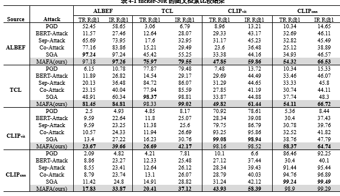

# MFHA


## Brief Introduction
Vision-Language Pre-training (VLP) models have achieved significant success in multimodal tasks but have exhibited vulnerability to adversarial examples. Although adversarial attacks are harmful, they are valuable in revealing the weaknesses of VLP models and enhancing their robustness. 

However, due to the insufficient exploitation of modal differences and consistent features by existing methods, the attack effectiveness and transferability of adversarial examples are not optimal.To address this issue, we propose the Multimodal Feature Heterogeneous Attack (MFHA) framework. To enhance the attack capability, We propose a feature heterogeneity method based on triple contrastive learning. First, we use data enhancement crossmodal guidance to attack different modal features. Then, within the same modality, we let the adversarial samples learn the difference feature of other different samples, losing their original  features. Finally, we use the global features of the text modality and the local features of the image modality to interfere with each other, further widening the feature difference between modalities, thereby obtaining stronger attack capabilities.To promote transferability, we propose a multi-domain feature perturbation method based on cross-modal variance aggregation. First, in both spatial and frequency domains, text-modal-guided feature attacks are employed to compute the dual-sampling aggregated gradient variance information. Then, by combining the gradient momentum information from the previous iteration, the consistent features of the modalities are disturbed, resulting in improved transferability.Extensive experiments conducted under various settings demonstrate the significant advantage of our proposed MFHA in terms of transferable attack capability, with an average improvement of 16.05\%.Furthermore, we emphasize that our MFHA also exhibits outstanding attack performance on large-scale multimodal models such as MiniGPT4 and LLaVA.

## Quick Start 
### 1. Install dependencies
See in `requirements.txt`.

### 2. Prepare datasets and models
Download the datasets, [Flickr30k](https://shannon.cs.illinois.edu/DenotationGraph/) and [MSCOCO](https://cocodataset.org/#home) (the annotations is provided in ./data_annotation/). Set the root path of the dataset in `./configs/Retrieval_flickr.yaml, image_root`.  
The checkpoints of the fine-tuned VLP models is accessible in [ALBEF](https://github.com/salesforce/ALBEF), [TCL](https://github.com/uta-smile/TCL), [CLIP](https://huggingface.co/openai/clip-vit-base-patch16).

### 3. Attack evaluation
From ALBEF to TCL on the Flickr30k dataset:
```python
python eval_albef2tcl_flickr.py --config ./configs/Retrieval_flickr.yaml \
--source_model ALBEF  --source_ckpt ./checkpoint/albef_retrieval_flickr.pth \
--target_model TCL --target_ckpt ./checkpoint/tcl_retrieval_flickr.pth \
--original_rank_index ./std_eval_idx/flickr30k/ --scales 0.5,0.75,1.25,1.5
```

From ALBEF to CLIP<sub>ViT</sub> on the Flickr30k dataset:
```python
python eval_albef2clip-vit_flickr.py --config ./configs/Retrieval_flickr.yaml \
--source_model ALBEF  --source_ckpt ./checkpoint/albef_retrieval_flickr.pth \
--target_model ViT-B/16 --original_rank_index ./std_eval_idx/flickr30k/ \
--scales 0.5,0.75,1.25,1.5
```

From CLIP<sub>ViT</sub> to ALBEF on the Flickr30k dataset:
```python
python eval_clip-vit2albef_flickr.py --config ./configs/Retrieval_flickr.yaml \
--source_model ViT-B/16  --target_model ALBEF \
--target_ckpt ./checkpoint/albef_retrieval_flickr.pth \
--original_rank_index ./std_eval_idx/flickr30k/ --scales 0.5,0.75,1.25,1.5
```

From CLIP<sub>ViT</sub> to CLIP<sub>CNN</sub> on the Flickr30k dataset:
```python
python eval_clip-vit2clip-cnn_flickr.py --config ./configs/Retrieval_flickr.yaml \
--source_model ViT-B/16  --target_model RN101 \
--original_rank_index ./std_eval_idx/flickr30k/ --scales 0.5,0.75,1.25,1.5
```


## Transferability Evaluation
The performance of SGA on four VLP models (ALBEF, TCL, CLIP<sub>ViT</sub> and CLIP<sub>CNN</sub>), the Flickr30k dataset.




## Visualization


### Citation
Kindly include a reference to this paper in your publications if it helps your research:
```
@misc{lu2023setlevel,
    title={Set-level Guidance Attack: Boosting Adversarial Transferability of Vision-Language Pre-training Models},
    author={Dong Lu and Zhiqiang Wang and Teng Wang and Weili Guan and Hongchang Gao and Feng Zheng},
    year={2023},
    eprint={2307.14061},
    archivePrefix={arXiv},
    primaryClass={cs.CV}
}
```
